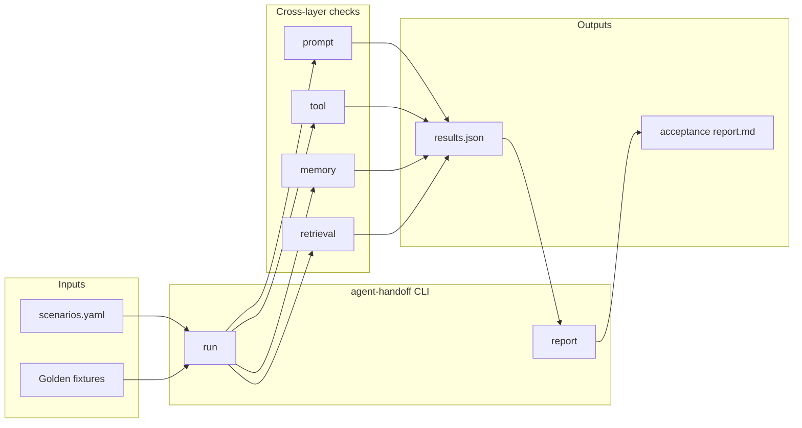

# agent-handoff

[](https://github.com/mastroke/agent-handoff/actions/workflows/ci.yml)
[](https://www.python.org/downloads/)
[](LICENSE)

Golden-scenario baseline and client handoff acceptance reports for AI agencies.

When an agency closes a $10–30k agent build, the client asks: *how do we know it won't silently break after deploy?* Observability tools show traces; they don't produce sign-off artifacts. This CLI runs frozen scenarios across four layers and emits a procurement-ready acceptance report.

## Architecture



### Boundaries

| In scope (MVP) | Out of scope (MVP) |
| --- | --- |
| Deterministic mock replay against golden fixtures | Live LLM / agent runtime hooks |
| Four-layer pass/fail scoring | Continuous production monitoring |
| JSON results + Markdown report | Auto-remediation of failing layers |
| Example scenarios + procurement pack stub | Gumroad payment integration |

Future work: plug in live agent runners behind the same scenario schema; wire nightly regression from [agent-loop-hillclimber](https://github.com/mastroke/agent-loop-hillclimber).

## Quickstart

```bash
pip install -e ".[dev]"
agent-handoff run examples/agency-handoff/scenarios.yaml
agent-handoff report examples/agency-handoff/scenarios.results.json -o handoff-report.md
```

With the paid procurement template pack:

```bash
agent-handoff report results.json --pack -o handoff-report.md
```

## Scenario format

Each scenario defines expected vs actual values for all four layers:

```yaml
project: my-agent
scenarios:
  - name: tool-schema-drift
    description: Tool args must match frozen schema snapshot.
    layers:
      prompt:
        expected: "..."
        actual: "..."
      tool:
        expected: { name: search, args: { q: "x" } }
        actual: { name: search, args: { q: "x" } }
      memory:
        expected: { user_id: "a", facts: [] }
        actual: { user_id: "a", facts: [] }
      retrieval:
        expected: ["doc-1"]
        actual: ["doc-1"]
```

Overall handoff verdict is **PASS** only when every scenario passes every layer.

## Agency Handoff Pack ($49)

The OSS CLI is free (MIT). The **Agency Handoff Pack** adds:

- Branded report template with procurement attestation block
- SOW snippet for acceptance baseline language
- Client onboarding runbook

See [`pack/procurement/README.md`](pack/procurement/README.md). Gumroad listing: *pending* — create account via operator queue.

## Development

```bash
python -m pytest -q
```

## License

MIT — see [LICENSE](LICENSE).
